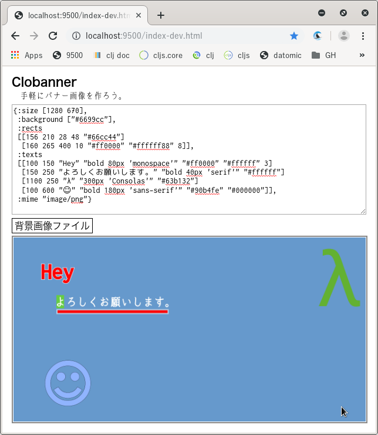

# Clobanner

[バナー画像を手軽に生成するWebアプリ](https://gpsoft.github.io/clobanner/)です。

- 画像の合成には、HTML5のキャンバスを利用
- 開発言語はClojureScript
- GUIは割愛して、バナー画像の情報は[edn(https://github.com/edn-format/edn)](https://github.com/edn-format/edn)形式で記述
- 背景画像ファイルを指定可能

`:background`のパターンは:

- `[color]`
- `[color sx sy]`
- `[color sx sy sw]`
- `[color sx sy sw dx dy]`
- `[color sx sy sw dx dy dw]`
- `[color sx sy sw dx dy dw dh]`

`color`は背景色、`s*`は背景画像ファイルのどこを切り取るか、`d*`はキャンバスのどこに貼るかを指定。`sh`は指定不可。

`:texts`の中の各テキストには、X座標、Y座標、出力文字列、フォント情報(cssのfont相当)、文字色、文字の縁の色、文字の縁の太さを指定。文字の縁に関する情報は省略可能。

`:rects`も`:texts`と似たような感じ。

`:mime`は、出力する画像のMIMEタイプ。

# 開発

使うツールは:

- Clojureの[CLIツール(tools.deps)](https://clojure.org/guides/getting_started)
- [figwheel](https://github.com/bhauman/figwheel-main)
- [rebel-readline](https://github.com/bhauman/rebel-readline)
- nREPLサーバ
- Vim
- [vim-fireplace](https://github.com/tpope/vim-fireplace)
- [piggieback](https://github.com/nrepl/piggieback)

などなど。

まずはサーバ群を起動:

    $ clojure -Adev

デフォルトのブラウザで、`http://localhost:9500/index-dev.html`が開くはず(開かなければ手動で)。この時点でfigwheelとつながり、自動ビルド&リロードがONになる。

Vimで`core.cljs`を開いて、nREPLサーバと接続しCLJS REPLセッションを開始:

    :Piggieback (figwheel.main.api/repl-env "dev")

開発用のビルドオプションは、`dev.cljs.edn`に記述。

TODO:

- バナー画像情報ednのspecチェック
- リアルタイム更新をdisableする機能
- use re-frame?
- localStorageにストック

# リリース

リリース用のビルドオプションは、`prod.cljs.edn`に記述。

ビルド:

    $ clojure -Aprod

あとは、`resources/public/`の下をWebサーバへデプロイ(あるいは、ブラウザで直接`index.html`を開く)。

- `index.html`
- `css/`
- `img/`
- `js/clobanner.js`
